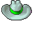
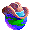
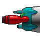
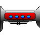
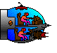
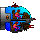
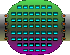
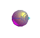
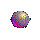

# Missing art and sound, per skin

This is a running list for future creative work: what each skin still borrows from
another skin, or leaves silent, because its source game has no picture or sound for it.
Update it when a skin gains or loses art.

The versions came in this order: **2.0** (Windows 3.1 1992, DOS 1993), **4.0.5** (Mac and
Windows 95, 1996), **5.0.5** (Mac). Each later version added features, and with them new
pictures and sounds, so an earlier version's skin is naturally missing the art for things
that hadn't been invented yet. A feature a later version dropped means the later skin
needs an entry here too.

- The **classic** skin (the Mac 5.0.5 art and sounds) is complete and is the fallback for
  every other skin.
- Anything another skin doesn't provide is drawn with the classic art. Sounds are the
  exception: a skin can choose silence instead.
- Each borrowed picture below links to the classic file it borrows, so it can be redrawn
  in the other version's style.

## The same things in every version (a style guide)

Five things every version draws. Compare these when making a stand-in for one version
from another's picture.

| | 5.0.5 (classic) | 2.0 (DOS, Windows 3.1) | 4.0.5 (Windows 95) |
|---|---|---|---|
| Your colony, with your hat |   [`planet3`](../assets/sprites/planet3.png) + [`white0_0`](../assets/sprites/white0_0.png) |  [`i1000`](../assets/skins/dos/sprites/i1000.png) |  [`b1053`](../assets/skins/w95/sprites/b1053.png) |
| A computer player's planet |  [`bad3_0`](../assets/sprites/bad3_0.png) |  [`i2003`](../assets/skins/dos/sprites/i2003.png) |  [`b2003`](../assets/skins/w95/sprites/b2003.png) |
| A ship (engine, hull, nose) | [`ships`](../assets/sprites/ships.png) (one sheet of parts) |  [`d12100`](../assets/skins/dos/sprites/d12100.png) [`d12199`](../assets/skins/dos/sprites/d12199.png) [`d12350`](../assets/skins/dos/sprites/d12350.png) |  [`b2600`](../assets/skins/w95/sprites/b2600.png) [`b2699`](../assets/skins/w95/sprites/b2699.png) [`b2850`](../assets/skins/w95/sprites/b2850.png) |
| A satellite |  [`satellite`](../assets/sprites/satellite.png) |  [`d12401`](../assets/skins/dos/sprites/d12401.png) |  [`b2901`](../assets/skins/w95/sprites/b2901.png) |
| A money message |  [`m9000`](../assets/sprites/m9000.png) |  [`i3110`](../assets/skins/dos/sprites/i3110.png) |  [`b3110`](../assets/skins/w95/sprites/b3110.png) |

Title pictures, for the overall look: [5.0.5 `p6999`](../assets/sprites/p6999.png),
[2.0 `d998`](../assets/skins/dos/sprites/d998.png) / [`d999`](../assets/skins/dos/sprites/d999.png), [4.0.5 `b316`](../assets/skins/w95/sprites/b316.png).

## What a full skin provides

This is the checklist for a new skin (cozy, scifi …). The names are the classic skin's
sprite and sound names (`assets/manifest.json`). A skin built on the classic page
replaces them through `window.HOTHEME` (see `js/skins/dos/ui.js`). A skin with its own
page can use any names it likes.

| Slot | Classic names | Used for |
|---|---|---|
| Planets | `planet0`–`6`, `mined0`–`6` (7 sizes), `pmask0`–`6`, `hot`, `icecap`, `metal0`–`4` | a planet drawn by size, temperature and metal |
| Unknown planets | `unknown`, `soon`, `battle` | unexplored, fleet on its way, battle seen |
| Novas | `nova0`–`4` (turning red), `nova12` (explosion), `nova18` (wreck) | Original and DOS rules |
| Hats | `white0`–`3_0/1` (yours: profitable / good / so-so / hostile; man / woman), `bad0`–`15_0/1` (16 computer players) | owner shown on the planet; faces in the Players window |
| Ships | `ships` (one sheet of parts), `part*`, `colony*`, `satellite*`, `dread*`, `tanker*`, `bio*`, `decoy*`, `eyeship*` | a ship's picture from its type and tech |
| Fleet markers | `dot0`–`4` × type 0–6 × count 0–3 | the little squares beside planets |
| Map extras | `haloAlly`, `haloSel`, `sun` | ally underline, selection, galaxy centre |
| Battle | `debris`, the planet picture in the `ships` sheet | battle replay |
| Message pictures | `m9000`–`m9051` | one per kind of report |
| Big pictures | `p3030` (won), `p3040` (lost), `p6999` and `t7000`–`7017` (title animation) | |
| Rank pictures | `assets/explore/01`–`25.jpg` | Original rules ranks |
| Panel extras | `tempbar`, `g*`, `crit*` | planet panel bars and markers |
| Sounds | `2000` good news, `2001` bad news, `3000`–`3003` battle, `4000`/`4001` fleet stays/goes, `5000`–`5003` messages and pacts, `6000`–`6002` explored (good/so-so/bad), `7001` next message, `7002` evacuate, `7003` scrap, `7006` build, `7016` out of range, `7013`–`7020` reports, `7021` won / eliminated / new rank, `7022`/`7023` title, `8000` meteors, `11111` end turn, `128` new game | |
| Music | `assets/theme.mp3` | title screen (optional) |

## classic

Nothing is missing. A few things are drawn by code rather than with art; a new skin could
give them pictures:

- the glow round the selected planet;
- the ring showing satellites at a planet;
- route lines and arrows;
- the white backing behind fleet markers;
- the End Turn clock button;
- the toast pop-ups.

## dos (DOS 2.0)

The DOS 2.0 game (and the identical Windows 3.1 2.0 game) has fewer pictures and sounds
than the Mac 5.0.5 game.

### Pictures borrowed from classic

- **Planet details.** The DOS planet icons don't show size, heat, ice caps or metal; the
  game picks one of a few icons by profit, gravity and metal. A creative version could
  add these to the DOS look.
- **Novas:** none. The 2.0 game hasn't got novas yet, so there's no nova picture; with other
  rules a nova shows as a plain empty planet. To draw: the turning-red stages [`nova0`](../assets/sprites/nova0.png), [`nova1`](../assets/sprites/nova1.png), [`nova2`](../assets/sprites/nova2.png), [`nova3`](../assets/sprites/nova3.png), [`nova4`](../assets/sprites/nova4.png), the explosion [`nova12`](../assets/sprites/nova12.png) and the wreck [`nova18`](../assets/sprites/nova18.png).
- **Ships added after 2.0** (Original and Claude rules only): Dreadnought [`dread`](../assets/sprites/dread.png), Tanker
  [`tanker`](../assets/sprites/tanker.png), Biologicals [`bio0`](../assets/sprites/bio0.png), [`bio1`](../assets/sprites/bio1.png), [`bio2`](../assets/sprites/bio2.png), [`bio3`](../assets/sprites/bio3.png), Decoy [`decoy`](../assets/sprites/decoy.png), the eye ship [`eyeship`](../assets/sprites/eyeship.png).
- **Fleets:** the DOS game marks only your own fleets at a star, all with the same small
  icon (`s3114`), plus a white ring for satellites. It draws nothing for fleets in flight
  or for anyone else's fleets. The skin does the same, except that it keeps the icon on
  your fleets in flight so they can still be picked. A per-ship-type marker would be a
  creative addition.
- **Message pictures:** the DOS game has a picture for each kind of report (tech, new year,
  money, scrapping, ships, explored planet, the other player's face, else your own icon).
  Reports that only exist in other rulesets (alliances, armageddon, ranks …) get your own
  icon.
- **Battles:** the DOS battle replay uses the small ship parts, mirrors the right-hand
  side and shows sparks (`s12000`–`12003`) on hits; the skin still uses the classic
  battle replay with the DOS ship pictures. The battle won/lost pictures `d3500`/`d3510`
  aren't shown yet.
- **Other pictures:**
  - the rank pictures, [`assets/explore/01`–`25.jpg`](../assets/explore/) (ranks came later);
  - the alliance underline [`haloAlly`](../assets/sprites/haloAlly.png) (alliances came later);
  - battle [`debris`](../assets/sprites/debris.png);
  - the temperature and gravity bars [`tempbar`](../assets/sprites/tempbar.png), [`g3550`](../assets/sprites/g3550.png), [`g3551`](../assets/sprites/g3551.png), [`g3552`](../assets/sprites/g3552.png), [`g3553`](../assets/sprites/g3553.png), [`g3554`](../assets/sprites/g3554.png), [`g3555`](../assets/sprites/g3555.png);
  - the alert picture `d3520` and the message-bar backdrop `d5030`.
- **Hats for players 16–19:** the DOS game has 20 computer faces and the engine uses 16,
  so four DOS faces go unused.

### Sounds

The DOS game has 14 sounds, and the Windows 3.1 build shows where each is used: 1000 the
click (and most reports), 2000/2001 good and bad news, 3000–3003 battle shots, 4000/4001
fleet stays/goes, 5000 message sent, 6000–6002 exploring, 7000 end of turn. The skin
follows that. Everything else is silent, as in the DOS game:

| Classic sound | Plays for |
|---|---|
| `5001`–`5003` | pact and chat replies |
| `7002` | evacuate, quit |
| `7003` | scrap |
| `7004` | baby boom |
| `7016` | out of range |
| `7021` | new rank |
| `7022`/`7023` | title animation |
| `8000` | meteor shower |

There is no theme music.

### DOS art not used yet

These are available in `assets/skins/dos/sprites/` for later:

- `d3500` / `d3510`: battle won / lost; `d3520`: the alert and game-info picture;
- `d3550`: a skull (not used by the 2.0 game either);
- `d1002`: the "2.0" frame (startup screen); `d9999`: the New World Computing logo;
- `d5001`: the pressed End Turn button; `d5030`: the message-bar backdrop;
- `i3010`/`i3011`: "Planet"/"Player" in the Send Message window; `i3000`–`3002`: "I like",
  "I don't like", "I own";
- `i3020`–`3024` (galaxy shapes), `i3030`–`3032` (computer skill), `i3040`–`3044` (sizes),
  `i3050`/`i3051` (dense/sparse): the Create Galaxy window's icons;
- `i128`, `i200`–`203`, `i2499`: not used by the 2.0 game;
- the other small `s*` icons and the 40×40 small ship parts `d12600`–`12926`;
- `d12251`–`12256`: two hidden special ships (now shown for the right designs).

The Windows 3.1 build adds one picture the DOS one lacks: its own title card (`d1000`,
"Windows Programming by Steven Ohmert"). It isn't extracted.

## amiga (Amiga 2.0)

The Amiga version (German, 1994; Amiga conversion by Stefan "Bebbo" Franke) is the DOS 2.0
game, so it is missing everything the DOS skin is missing (above). It has two sets of the
same pictures: 256 colours for AGA Amigas (identical to the DOS pictures, so not used) and
16 colours for older Amigas, which is what this skin shows. Differences from the DOS skin:

- **Its own:** the one-piece title picture ([`title`](../assets/skins/amiga/sprites/title.png))
  and the German End Turn button "Zug Ende / Amiga+Z"
  ([`d5000`](../assets/skins/amiga/sprites/d5000.png)). The skin shows an English copy
  ([`endturn`](../assets/skins/amiga/sprites/endturn.png)) that `tools/extract/amiga.py`
  draws into it: E, n, d and u copied from the German lettering, T and r made to match.
- **Not in the Amiga set:** the DOS title halves (`d998`, `d999`; replaced by `title`),
  `d9999` and the unused icons `i128`, `i200`, `i202`, `i203`, `i3011`, `s200`–`202`.
- **Amiga art not used yet:** three extra 40×40 planets
  ([`d12758`](../assets/skins/amiga/sprites/d12758.png)–`d12760`), a help picture
  ([`a539`](../assets/skins/amiga/sprites/a539.png)), an asterisk (`a536`) and the New
  World Computing bird and name (`a537`, `a538`).
- **Sounds:** the same 14 as DOS.
- **Text:** the game's 838 German strings are in
  [`strings.json`](../assets/skins/amiga/strings.json). The page itself stays in English.
  The Amiga version also played by mail ("Briefspiel": each player's moves saved to a file
  and merged) and over a network; neither can be done here (see hot seat in the README).

## mac3 (Mac 3.0.1, black and white)

Spaceward Ho! 3.0.1 for the Macintosh (Delta Tao, 1993) on one floppy. Its pictures are
black and white; it read colour versions from a separate file, "Ho! 3.0 Color Picts", which
isn't on the floppy. The DOS game's colour pictures have the same numbers, so they are very
likely those colour pictures. The skin uses the DOS skin's code, so it is missing what the
DOS skin is missing (above), with these differences:

- **Its own:** the credits title picture ([`p1001`](../assets/skins/mac3/sprites/p1001.png)),
  an English End Turn button "End Turn ⌘T" ([`p5500`](../assets/skins/mac3/sprites/p5500.png),
  pressed: `p5501`), won and lost pictures (`p3530`, `p3540`) and the Mac sounds with their
  5.0.5 numbers, including "Move 'em out!" (10000, played on the title screen).
- **Smaller ship pictures:** the parts are 40×40 (`p2600`–`p2926`), shown at twice the size.
  There are no 81×76 ones as in DOS.
- **The battle planet** is the plain planet icon `i1004`: 3.0.1 has no battle planet picture
  of its own that we've found.
- **3.0.1 art not used yet** (for features the DOS 2.0 game lacks, e.g. alliances,
  surrender, battle luck): icons [`i3140`](../assets/skins/mac3/sprites/i3140.png) (black
  cat: bad luck), [`i3142`](../assets/skins/mac3/sprites/i3142.png) (horseshoe: good luck),
  `i3150`–`i3164`, `i4011`–`i4017`, `i1010`–`i1013`, `i1512`, `i1513`, `i1600`, the
  168×56 strips `p6100`–`p6140`, the "Version 3.0" picture `p1003`, and `p506`/`p507`/`p510`/`p511`
  (rings with a halo).
- **Not in 3.0.1:** `i128` and `i2499` (unused by the DOS skin too).

## w95 (4.0.5, Windows 95)

Where 4.0.5 uses each picture and sound was read from SPACEHO.EXE. 4.0.5 sits between 2.0
and 5.0.5: it has most of 5.0.5's features, so less is borrowed than for DOS.

### Pictures borrowed from classic

- **A nova's wreck:** [`nova18`](../assets/sprites/nova18.png). 4.0.5 shows a swollen sun ([`b1403`](../assets/skins/w95/sprites/b1403.png)) while a star
  is turning red or exploding, then nothing at all where the star was.
- **The eye ship and other 5.0.5 special ships** ([`eyeship`](../assets/sprites/eyeship.png)): 4.0.5 has its own two hidden
  specials ([`b2751`](../assets/skins/w95/sprites/b2751.png)–[`b2756`](../assets/skins/w95/sprites/b2756.png)) instead.
- **Rank pictures**, [`assets/explore/`](../assets/explore/): 4.0.5's ten ranks have no
  pictures (and ranks are off for the 4.0.5 rules for now).
- **Message pictures** for reports 4.0.5 doesn't have: they get your own planet icon.
- **Battle debris** [`debris`](../assets/sprites/debris.png): 4.0.5 draws shrinking and growing ellipses when a ship
  dies, and sparks ([`b12000`](../assets/skins/w95/sprites/b12000.png)–[`b12002`](../assets/skins/w95/sprites/b12002.png)) on hits.

### 4.0.5 art not used yet

- the nova explosion animation [`b7728`](../assets/skins/w95/sprites/b7728.png)–[`b7741`](../assets/skins/w95/sprites/b7741.png) then [`b7750`](../assets/skins/w95/sprites/b7750.png)–[`b7758`](../assets/skins/w95/sprites/b7758.png);
- the dreadnought's animation frames [`b7261`](../assets/skins/w95/sprites/b7261.png)–[`b7274`](../assets/skins/w95/sprites/b7274.png) (the skin shows frame
  [`b7260`](../assets/skins/w95/sprites/b7260.png));
- the planet window's rotating globe strips ([`b6100`](../assets/skins/w95/sprites/b6100.png)–[`b6130`](../assets/skins/w95/sprites/b6130.png), ice caps
  [`b6150`](../assets/skins/w95/sprites/b6150.png)/[`b6151`](../assets/skins/w95/sprites/b6151.png)) and landscapes by temperature ([`b1300`](../assets/skins/w95/sprites/b1300.png)–[`b1305`](../assets/skins/w95/sprites/b1305.png));
- the terraform/mine split slider [`b1410`](../assets/skins/w95/sprites/b1410.png) with its knob [`b1411`](../assets/skins/w95/sprites/b1411.png);
- money and metal piles [`b311`](../assets/skins/w95/sprites/b311.png) (money), [`b312`](../assets/skins/w95/sprites/b312.png) (debt), [`b313`](../assets/skins/w95/sprites/b313.png) (metal);
- the 16×16 planet and face icons ([`b8000`](../assets/skins/w95/sprites/b8000.png)–[`b9519`](../assets/skins/w95/sprites/b9519.png)) used when zoomed out;
- the ally / best-buddy halos (rows of [`b175`](../assets/skins/w95/sprites/b175.png); [`b13000`](../assets/skins/w95/sprites/b13000.png)/[`b13001`](../assets/skins/w95/sprites/b13001.png) in the
  player list), and the selection ring's 5-frame animation;
- the New Game option icons [`b114`](../assets/skins/w95/sprites/b114.png)–[`b133`](../assets/skins/w95/sprites/b133.png) and the message-type icons
  [`b10000`](../assets/skins/w95/sprites/b10000.png)–[`b10014`](../assets/skins/w95/sprites/b10014.png);
- the pressed End Turn clock [`b367`](../assets/skins/w95/sprites/b367.png), the report window background [`b345`](../assets/skins/w95/sprites/b345.png), the
  About/start-up pictures [`b316`](../assets/skins/w95/sprites/b316.png) and [`b383`](../assets/skins/w95/sprites/b383.png) (New World logo), and [`b3520`](../assets/skins/w95/sprites/b3520.png);
- the Christmas planet [`b1404`](../assets/skins/w95/sprites/b1404.png) (25 December) and the "Peter"/"Howard" easter-egg planets
  [`b3115`](../assets/skins/w95/sprites/b3115.png)/[`b3116`](../assets/skins/w95/sprites/b3116.png) ([`b3615`](../assets/skins/w95/sprites/b3615.png)/[`b3616`](../assets/skins/w95/sprites/b3616.png)).

### Sounds

All 37 sounds are wired to their 4.0.5 events except: `ahem` and `checkout` (what triggers
them is unclear), `bonus`, `timeup` and `hurryup` (the turn timer and network play aren't
in the remake), `nocheat` (4.0.5's cheat detector) and `shipbp` (the 4.0.5 game never plays
it). There is no theme music.

## 5.0.5 entries for things 4.0.5 had

4.0.5 features that 5.0.5 dropped, so the classic skin has no art for them when you play
with the 4.0.5 rules (they fall back to general pictures):

- the "your population now exceeds …" milestones and the "a big battle just took place"
  rumours (4.0.5: [`b4024`](../assets/skins/w95/sprites/b4024.png), [`b3119`](../assets/skins/w95/sprites/b3119.png));
- the turn timer (the clock with time left, and its `bonus` / `timeup` sounds);
- the ten 4.0.5 ranks (Red-Neck … Ho! Champion) and the Hall of Shame;
- the money and metal piles and the planet window's globe and landscapes (5.0.5 shows
  planet pictures and the explore pictures instead).

## cozy, scifi (planned)

Everything: these skins don't exist yet. Use the checklist at the top.
